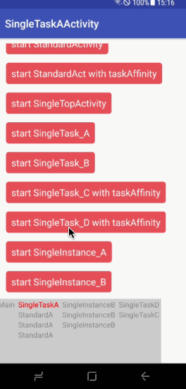

# LifecycleObserver
复习android 生命周期demo

[官方文档](https://developer.android.com/guide/components/activities/tasks-and-back-stack.html)

跳转新activity的时候,请先不要快速连续跳转, 不然无法触发前一个activity的onStop()方法,悬浮窗可能就没法隐藏了, 暂时还没找到好方法 /(ㄒoㄒ)/~~

还是有蛮多好玩的情况的,比如

